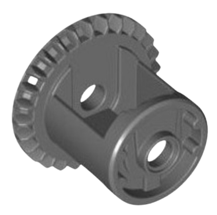
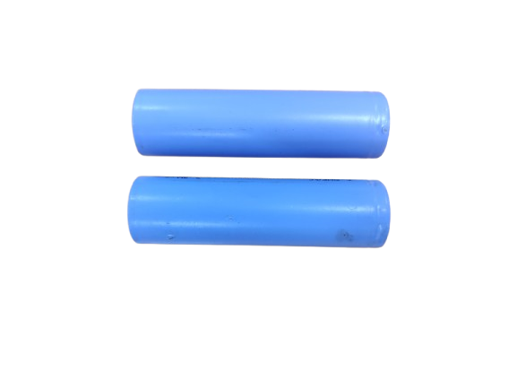

# Engineering Report

# 移動性管理

## 底盤

### 驅動系統

### 馬達控制板
#### L298N
- IC 型號	L298N 雙 H 橋馬達驅動 IC
- 驅動電壓	5V ~ 35V（邏輯電壓 5V）
- 邏輯電壓	5V（模組可內建穩壓器）
- 最大輸出電流	2A / 每通道（瞬間最大可達 3A）
- 驅動通道數	2 通道（可驅動兩個直流馬達或一個雙極步進馬達）
- 控制方式	數位訊號控制（IN1 ~ IN4）、PWM 調速
- 支援功能	正轉、反轉、剎車、停止、PWM 調速
- 功耗	依負載與驅動電壓而異
- 模組接腳說明：
    - 接腳	功能
    - IN1 / IN2	控制馬達A方向
    - IN3 / IN4	控制馬達B方向
    - ENA / ENB	啟用並調速（通常接 PWM）
    - OUT1 / OUT2	馬達A輸出
    - OUT3 / OUT4	馬達B輸出
    - VCC	馬達電源（5V ~ 35V）
    - GND	接地
    - 5V	模組內部邏輯電壓輸出/輸入（若使用板上穩壓器，插跳線帽以供應5V）
<div align="center">

</div>

#### 後輪直流馬達

在後輪驅動部分使用一顆130RPM 的直流馬達（DC Motor）作為動力來源。直流馬達具有轉速穩定、控制方式簡單的特性。本系統透過金屬齒輪組將馬達輸出連接至變速器，以調整扭力與轉速的傳遞效率，使車輛具備良好的啟動能力與穩定的行進速度。金屬齒輪具有良好的強度與耐磨性，可提升整體傳動系統的壽命與可靠度。

- 優點
  - 控制簡單，可透過 PWM 輕鬆調整速度
  - 可提供穩定扭力，適合驅動車輪
  - 搭配金屬齒輪與變速機構，提升扭力輸出並延長使用壽命
  - 兼具穩定推進與反應速度

<div align="center">

</div>

#### 變速機構

我們考慮使用差速器結構作為後輪驅動的變速機構之一。差速器是一種可以同時傳遞動力與允許左右車輪轉速不同的機構，常用於汽車後輪驅動系統中。當車輛直線行駛時，兩側輪子等速旋轉；當轉彎時，內外側輪子轉速不同，差速器內部的行星齒輪則會自動補償兩側轉速差，維持動力平衡並減少輪胎摩擦。

圖 1（左圖）| 展示車輛直行時的差速器狀態，左右輪轉速一致，綠色中間齒輪不轉。

圖 2（右圖）| 展示車輛轉彎時的狀態，一側輪子轉速下降，差速器內部齒輪開始旋轉來補償另一側輪子的加速。

<p align="center">
  
  
</p>
<p align="center"><b>圖 1（左）：直行狀態  圖 2（右）：轉彎補償</b></p>


<div align="center">

</div>
<div align="center">樂高變速器</div>

### 轉向系統
#### Ackermann Steering Mechanism (阿克曼轉向機構介紹)

本設計採用了 **阿克曼轉向機構（Ackermann Steering Mechanism）** 作為前輪轉向方案。該機構透過幾何設計，使車輛在轉彎時前輪能指向同一圓心，內外輪轉向角度不同，符合理想轉彎軌跡。這種設計常見於真實汽車中，能有效提升轉彎穩定性與轉向效率。本車輛的阿克曼機構由光固化3D列印製作，搭配伺服馬達驅動，實現準確且穩定的轉向控制。
- 優點
  - 減少輪胎在轉彎時的滑移與磨損
  - 提高轉彎的穩定性與效率
  - 模擬真實車輛的轉向行為，提升真實感與控制精度
  - 可與伺服馬達整合，實現精準轉角控制

<div align="center">

</div>
<div align="center">阿克曼轉向機構</div>

### 伺服馬達
#### MG90
- 工作電壓	4.8 V ～ 6.0 V
- 扭力	約 1.8 kg·cm（4.8 V）
約 2.2 kg·cm（6.0 V）
- 速度	約 0.1 秒 / 60°（4.8 V）
- 工作電流	空載約 100 mA，負載時更高
- 控制方式	PWM 控制，頻率約 50 Hz
- 齒輪材質	金屬齒輪（鋼齒）
- 軸承類型	雙軸承設計，提高穩定性
- 角度範圍	約 180°
<div align="center">

</div>

# 電源管理與感測

## 電源(電池、降壓、每個模組供電方式)

### 電源系統概要圖
<div style="text-align: center;">
    
</div>

### 電池
原先我們採用 18650 鋰電池 作為電源供應，但由於樹莓派運作時需要穩定的 5V 電壓，而單顆 18650 電池的電壓範圍介於 4.2V 至 3.0V，即使透過升壓模組轉換，當電量下降過快時仍容易導致 電壓不穩，進而產生 系統重啟、螢幕閃爍，甚至在寫入過程中造成 SD 卡損壞 等問題。

為了解決上述問題，我們改採 LiPo 3S 11.1V 鋰聚合物電池 作為主要電源。雖然需要額外配置降壓模組來將電壓轉為穩定的 5V，但相較於單顆 18650 電池，其具有 更高的輸入電壓裕度與更穩定的電流輸出，能有效改善電壓不穩所帶來的風險，並提升系統運行的可靠性與安全性。

<div style="text-align: center;">
  <table>
    <tr>
      <th style="text-align: center;">18650充電電池</th>
      <th style="text-align: center;">LiPo 3S 11.1V 鋰聚合物電池</th>
    </tr>
    <tr>
      <td>
        
      </td>
      <td>
        
      </td>
    </tr>
  </table>
</div>

### 降壓板
#### High Current 5A Constant Voltage Constant Current Buck Power Supply Module
- 輸入電壓	DC 4V ～ 38V（推薦 5V～36V）
- 輸出電壓	DC 1.25V ～ 36V（可調）
- 輸出電流	最大 5A（建議持續 4.5A 以下）
- 輸出功率	最大 75W（需加散熱片）
- 轉換效率	高達 96%（視輸入/輸出電壓與電流）
- 恆壓/恆流控制	可透過兩顆可調電位器分別設定輸出電壓與限流值
- 開關頻率	約 180kHz（視版本與晶片而定）
- 保護功能	輸出短路保護、過溫保護、過電流保護
<div align="center">

</div>

## 控制器
#### Raspbrry pi 4(8GB)
- 處理器 (CPU)
    - Broadcom BCM2711
    - 四核心 ARM Cortex-A72 (ARM v8) 64-bit 處理器
    - 時脈：1.5GHz
- 記憶體 (RAM)
    - 8GB LPDDR4 SDRAM
    - 記憶體與 SoC 整合在一個封裝上
- 圖形處理器 (GPU)
    - Broadcom VideoCore VI
    - 支援 OpenGL ES 3.0
- 輸出入埠 (I/O Ports)
    - 2 × USB 3.0
    - 2 × USB 2.0
    - 1 × Gigabit Ethernet (RJ45)
    - 40-pin GPIO header
    - CSI 相機介面
    - DSI 顯示介面
<div align="center">

</div>

## 感測器
### 攝影鏡頭
#### Sony IMX477
- 感測器類型：CMOS（背照式，BSI）
- 解析度：12.3 Megapixels
- 感測器尺寸：1/2.3 英吋
- 像素大小：1.55μm × 1.55μm
- 有效畫素：4056 × 3040
- 輸出格式：
    - RAW Bayer（10-bit / 12-bit）
    - 支援 MIPI CSI-2 數位輸出
<div align="center">

</div>

### 顏色感測器
#### TCS34725
- 感測元件類型RGB + Clear 光感測器
- 通訊介面I²C（最大 400 kHz）
- ADC 解析度16 位元（4 通道同步）
- 光感通道R（紅）、G（綠）、B（藍）、C（清光）
- 增益設定1x、4x、16x、60x
- 整合時間2.4 ms ~ 700 ms（可程式化）
- 紅外線濾光片內建，可提升色彩準確度
- 工作電壓2.7V ~ 3.6V（模組通常支援 3.3V / 5V）
- 輸出資料格式每通道 16 位元數值（R、G、B、C）
<div align="center">

</div>

### 光學雷達
#### LDROBOT D100 LiDAR
- 測距原理	Triangulation（CCD 三角測量）
- 掃描範圍	360° 全方位旋轉
- 測距範圍	0.15 ～ 8 公尺
- 角度解析度	約 1°
- 資料輸出頻率	約 2300 點/秒
- 掃描頻率	6 Hz（固定）
- 測距精度	±3 cm（典型值）
- 通訊介面	UART（3.3V TTL）
- 供電電壓	DC 5V（USB 或 UART）
<div align="center">

</div>


### 陀螺儀
#### BNO055 IMU
- 感測器內容	三軸加速度計 + 三軸陀螺儀 + 三軸磁力計 + 32-bit Cortex-M0F FUSION MCU
- 輸出數據	Quaternion（四元數）、Euler 角（Yaw, Pitch, Roll）、加速度、角速度、磁場、線性加速度、重力向量等
- 加速度範圍	±2g / ±4g / ±8g / ±16g
- 陀螺儀範圍	±125 / ±250 / ±500 / ±1000 / ±2000 dps
- 磁力計範圍	±1300 μT（X/Y 軸）、±2500 μT（Z 軸）
- 取樣率（輸出率）	最多 100 Hz（視模式）
- 絕對方向誤差	約 ±2.5°（典型值）
- 電壓需求	3.0V ~ 3.6V（模組常含穩壓可支援 3.3V / 5V）
- 通訊介面	I²C（100kHz～400kHz）與 UART（最大460800 bps）
- 內建演算法	Bosch Sensor Fusion Algorithm（可直接輸出姿態角）
<div align="center">

</div>

# 障礙管理

## 資格賽

### 功能概述
我們透過整合陀螺儀與光達，實現車子在限定空間內的繞圈移動行為。整體動作流程分為以下步驟：

一、初始化階段
啟動系統後，進行感測器初始化與通訊設定，同步讀取陀螺儀、光達與光感的資料，並透過光達資料進行初始位置的置中校正。

二、前進與距離判斷
車子向前行駛，光達持續檢測前方牆壁距離，當偵測到接近指定距離時，觸發轉彎程序。

三、轉彎動作
根據當前角度與預設目標角度，控制車子執行陀螺儀角度旋轉。旋轉完成後，再次透過光達執行橫向置中校正。

四、重複流程
校正完成後進入下一段直行流程，如此循環構成完整繞圈動作。

<div align="center">

</div>

### 光達置中校正運算

#### 補償原理:

一、角度轉換與投影修正

假設車身偏轉角度為 gyro（單位：度），轉換為弧度後，將原始距離乘上 cos(gyro)，修正光達讀值的投影誤差。
原因在於：當車身偏轉時，光達實際測得的是與牆面夾角方向的距離，其垂直距離需透過餘弦關係還原。

公式：
```
corrected_left  = left  × cos(gyro)
corrected_right = right × cos(gyro)
```
二、額外補償微調（角度漂移影響）

為進一步提升精度，對左右距離加入一項與角度成比例的補償量 angle_compensation = abs(gyro) × 0.005，模擬由於傾斜造成的視角偏移。

根據偏轉方向，左右距離分別加減該補償量：
```
if gyro > 0:
    corrected_left  -= angle_compensation
    corrected_right += angle_compensation
else if gyro < 0:
    corrected_left  += angle_compensation
    corrected_right -= angle_compensation
```

## 障礙挑戰賽
<div align="center">

</div>


### 功能概述

本系統為一套即時影像與感測器融合的避障控制機制，主要針對車子在移動過程中自動偵測前方障礙物（牆體與積木），並根據當前車身姿態動態調整避讓路徑。系統透過攝影機進行目標輪廓偵測，獲取障礙物位置，並結合陀螺儀輸出的車身旋轉角度進行座標補償，以修正因鏡頭畸變與車身姿態變化造成的誤差。
在避障邏輯中，系統會先根據車頭與目標物位置計算斜率，映射為伺服馬達轉向角度，生成基礎避讓方向；同時，系統會預測此路徑是否可能與牆體相交，若偵測到潛在碰撞，則計算交點位置並動態修正避讓方向，確保車輛在保持安全距離的前提下順利繞過障礙物。

### 顏色遮罩設定與輪廓擷取

為了辨識場地中的紅色與綠色積木，程式採用了 HSV 色彩空間來進行顏色篩選。與 RGB 不同，HSV 更適合處理顏色辨識的問題，因為它將顏色（Hue）、飽和度（Saturation）與明亮度（Value）分離，能更穩定地適應不同光照條件。

<div align="center">

</div>

使用 ``` cv2.inRange ``` 函式可以將在範圍內的像素轉為白色（255），不在範圍內的轉為黑色（0），形成二值遮罩。再透過 cv2.findContours 找出輪廓，即可擷取紅綠積木在影像中的位置。這些輪廓後續會用來判斷積木位置與大小，進一步進行避障判斷與行為控制。

根據設定好的色彩範圍，對畫面進行遮罩，找出特定顏色積木的區域
```
green_mask = cv2.inRange(hsv, green_lower, green_upper)
contours, _ = cv2.findContours(green_mask, cv2.RETR_EXTERNAL, cv2.CHAIN_APPROX_SIMPLE)
```

### 物件偵測及位置取得

系統透過影像處理（OpenCV）對畫面中的紅色牆或積木進行輪廓偵測。
為了後續避障，需要獲取該物件的矩形邊界座標 (x, y, w, h) 及其底部 y 座標 y_bottom，並找出距離車輛最近的目標。
```
for cnt in red_contours:
    area = cv2.contourArea(cnt)
    if area > 50:
        x, y, w, h = cv2.boundingRect(cnt)
        cv2.rectangle(imageFrame, (x, y), (x + w, y + h), (0, 0, 255), 2)
         y_bottom = y + h
        if y_bottom > max_y_bottom_red:
            max_y_bottom_red = y_bottom
            closest_tx_red = x + w + 100 + int(abs(gyro)*0.15)
            closest_ty_red = y
```

### 陀螺儀補償

由於攝影機鏡頭存在一定的畸變（廣角或桶狀變形），車輛在旋轉時，物體的投影位置會產生偏移，導致直接從影像計算的避障角度不準確。
為修正此誤差，將車輛的實際旋轉角度（由陀螺儀讀取）乘以一個比例係數，動態調整積木的 x 座標位置，達到補償效果。
```
closest_tx_red = x + w + 100 + int(abs(gyro)*0.15)
```

### 避障路徑計算

避障的基礎邏輯是根據車頭位置 (cx, cy) 與目標物位置 (bx, by) 計算斜率 m = dy / dx，再透過映射函數（mapping）將斜率轉換為伺服馬達的轉向角度。
此步驟處理「正常閃避路徑」，在沒有撞牆風險時直接執行。
```
dx = abs(bx - cx)
dy = abs(by - cy)
m = dy/dx
m = constrain(m, 0, 3)
servo_angle = mapping(m, 0, 3, 50, 10) 
servo.angle(servo_angle)
```

### 牆體碰撞檢測與路徑修正

為避免閃避過程中撞到牆，畫面會在多繪製一條斜線代表車身預計經過的避障路徑，並透過 ```cv2.clipLine``` 判斷此路徑是否與牆的矩形邊界相交。
若相交，計算交點最大 x 座標與牆右邊界的距離差 diff，並依車頭與積木相對位置（象限）調整原始 dx_raw，再重新計算修正後的斜率與伺服角度。

<div align="center">

</div>

判斷斜線與矩形是否重疊，並輸出斜線經過矩形的兩點
```
intersects, clipped_pt1, clipped_pt2 = cv2.clipLine(rect_red, (315, cy), (bx+75, by))
```
計算x位置校正後斜率及依照象限調整伺服馬達角度
```
x_man_overlap = max(clipped_pt1[0], clipped_pt2[0])
rect_right_x = rect_red[0]
diff = x_man_overlap - rect_right_x
if dx_raw > 0:
    dx_adjusted = dx_raw - diff - 22  # 第一象限處理
else:
    dx_adjusted = dx_raw + diff - 22  # 第二象限處理
if abs(dx_adjusted) < 1e-5:
    dx_adjusted = 1e-5 if dx_adjusted >= 0 else -1e-5
m = dy / dx_adjusted
m_abs = abs(m)
m_abs = constrain(m_abs, 0, 3)
if dx_adjusted > 0:
    servo_angle = mapping(m_abs, 0, 3, 50, 0)
    servo.angle(servo_angle) # 往右
else:
    servo_angle = mapping(m_abs, 0, 3, 30, 15)
    servo.angle(-servo_angle) # 往左
```

# 團隊營運

## 工作分配
| 姓名  | 負責項目    | 貢獻說明                                        |
| ------ | ------- | ------------------------------------------- |
| 蔡宜成 | 軟體程式設計  | 撰寫 Raspberry Pi 控制程式，包括感測器資料讀取、影像處理、路徑規劃邏輯。 |
| 林仲斌 | 撰寫Github與硬體電路與整合 | 設計並焊接電路板（含感測器與電源模組接線），負責供電穩定與模組連裝。             |
| 賴孟承 | 撰寫Github與機構設計與製作 | 使用 Onshape 設計底盤與轉向系統零件，負責3D列印與組接。          |
## 

# 未來發展

如何更深一步研究
