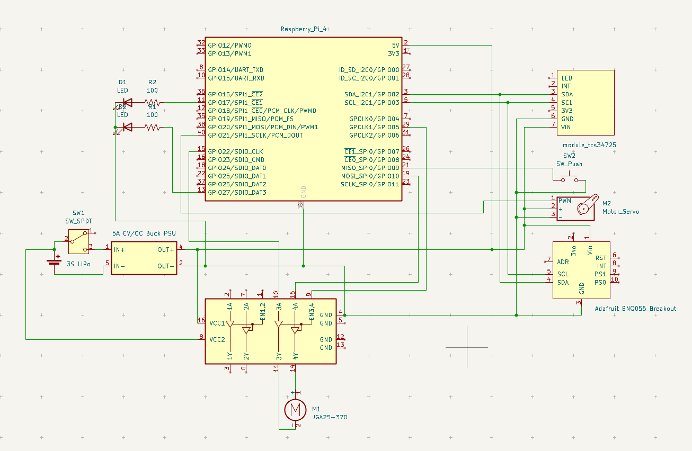

# Circuit Instruction

這是一張包含多個模組的電路圖，整體系統以 Raspberry Pi 4 為主控核心，搭配馬達、伺服馬達、感測器與電源模組等。以下是詳細說明：

#### Raspberry Pi 4
- 擔任主控板，透過 GPIO 腳位控制各元件。
- 使用 I2C 與 感測器（TCS34725、BNO055） 通訊。
- 控制馬達與伺服馬達。
- 接上 LED 作為指示燈（GPIO17、GPIO27）。
### 電源系統
#### 3S LiPo 電池（約 11.1V）
- 為系統提供主要電力。
- 透過 SPDT 開關（SW1）控制供電開啟與關閉。
#### 5A CV/CC Buck PSU
- 降壓模組將 3S LiPo 電壓轉為穩定的 5V 輸出。
- 供電給：
    - Raspberry Pi（5V 與 GND）
    - 馬達驅動模組（L298N）
    - 感測器模組（BNO055、TCS34725）
    - LED 等
### 馬達控制
#### JGA25-370
- 透過 L298N 馬達驅動模組 控制。
- L298N 使用 GPIO23（IN1）、GPIO24（IN2）進行方向控制。
- ENA 腳位（速度控制）接至 5V，意味著全速運轉（若要 PWM 調速，應接至 PWM 腳位）。
### 伺服馬達
- 標示為 Motor_Servo
- 透過 GPIO18 控制 PWM（第12腳）
### 感測器模組
#### TCS34725 顏色感測器
- 透過 I2C（SDA：GPIO2，SCL：GPIO3）與 Raspberry Pi 通訊。
- VIN 接 3.3V，代表使用 Pi 的邏輯電壓。
- LED 控制腳與 INT 腳未接，可能未使用其中斷或 LED 控制功能。
#### BNO055 姿態感測器(Adafruit_BNO055_Breakout)
- 同樣透過 I2C（SDA：GPIO2，SCL：GPIO3）與 Raspberry Pi 通訊。
- VIN 接 5V，模組內有穩壓器。
- 其他腳（如 RST、INT、PS1、PS0）未使用，表示在基本 I2C 模式下使用。
### LED 指示燈
- 兩顆 LED，分別由 GPIO17 與 GPIO27 控制。
- 各串聯一個 100Ω 電阻保護。
### 按鈕開關
- SW2 為 Push Button，接至 GPIO22，作為程式啟動開關使用。

### 總結:
| 子系統               | 功能     | 控制介面         |
| ----------------- | ------ | ------------ |
| Raspberry Pi 4    | 主控     | -            |
| L298N + JGA25-370 | 馬達控制   | GPIO23/24    |
| Servo 馬達          | PWM 控制 | GPIO18       |
| TCS34725          | 顏色偵測   | I2C（GPIO2/3） |
| BNO055            | 姿態感測   | I2C（GPIO2/3） |
| LED x2            | 狀態指示   | GPIO17/27    |
| 按鈕 SW2            | 使用者輸入  | GPIO22       |
| 降壓模組              | 提供穩壓電源 | 由 3S LiPo 供電 |