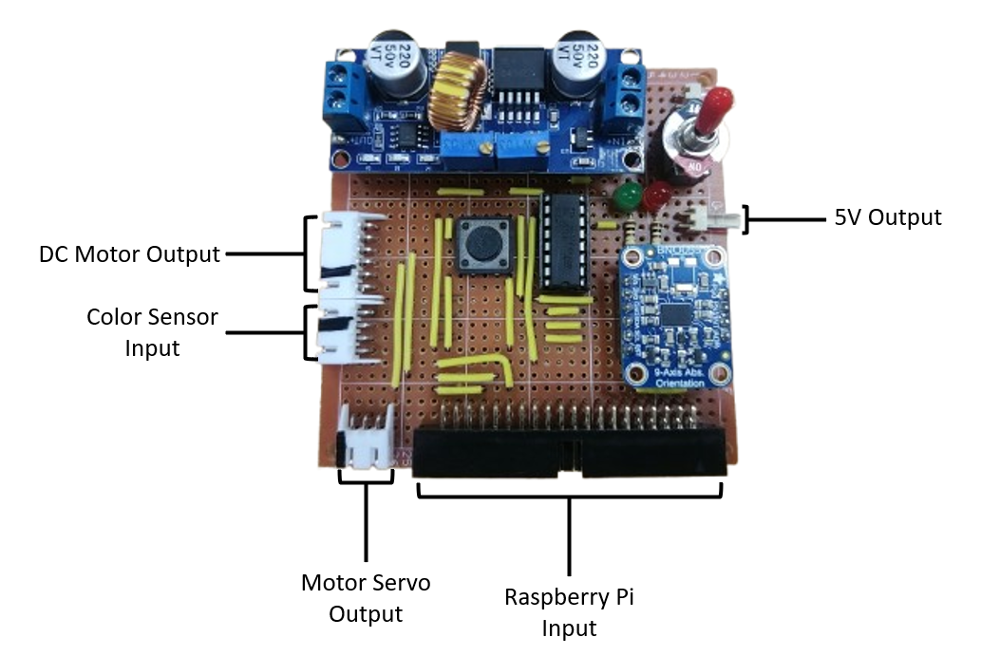

## 電路板模組示意

  

如上圖所示，此電路板搭載多項功能模組：

- Raspberry Pi Input：與 Raspberry Pi 主控板連接的輸入端口。

- DC Motor Output：直流馬達的電源輸出接口。

- Motor Servo Output：伺服馬達控制信號輸出。

- Color Sensor Input：顏色感測器數據輸入端口。

- 5V Output：穩壓後的 5V 電源輸出，供應系統其他模組。
## Circuit Instruction

  

本電路圖展示整體系統架構，核心控制單元為 Raspberry Pi 4，搭配多個模組包括直流馬達、伺服馬達、感測器及電源管理模組。以下為各模組詳細說明。

## 1. Raspberry Pi 4 主控板
- 作為系統中央控制單元，透過 GPIO 腳位對外連接並控制各周邊元件。

- 利用 I²C 通訊協定與 TCS34725 顏色感測器及 BNO055 姿態感測器進行資料交換。

- 控制 L298N 馬達驅動模組與伺服馬達動作。

- 使用 GPIO17 及 GPIO27 控制兩組 LED 指示燈。
W

## 2. 電源系統
### 3S LiPo 電池組 (標稱 11.1V)
- 作為系統主要電源來源。

- 配置 SPDT 開關（SW1）以實現主電源的開啟與關閉控制。

### 5A CV/CC 降壓穩壓電源模組 (Buck PSU)
- 將 3S LiPo 電池電壓穩定降至 5V，提供穩定電源給系統各模組。

- 供電對象包括 Raspberry Pi 4（5V, GND）、L298N 馬達驅動器、感測器模組（BNO055、TCS34725）及 LED 指示燈。

## 3. 馬達控制系統
### 直流馬達 (JGA25-370)
- 透過 L298N 雙向 H 橋馬達驅動模組控制。

- L298N 的 IN1、IN2 腳位分別連接 Raspberry Pi GPIO23 和 GPIO24，用以控制馬達旋轉方向。

- ENA 腳位目前直接接至 5V，代表馬達全速運轉；若需速度調控，建議接至 PWM 腳位並由軟體調節。

### 伺服馬達 (Motor_Servo)
- 使用 Raspberry Pi GPIO18 (物理腳位12) 輸出 PWM 控制訊號，實現角度定位。

## 4. 感測器模組
### TCS34725 顏色感測器
- 利用 I²C 通訊 (SDA: GPIO2, SCL: GPIO3) 與 Raspberry Pi 連接。

- 供電為 3.3V，確保感測器與 Pi 之間的邏輯電平相容。

- LED 控制腳及中斷腳 (INT) 目前未連接，表示未使用這些功能。

### BNO055 姿態感測器 (Adafruit_BNO055_Breakout)
- 同樣透過 I²C 介面 (SDA: GPIO2, SCL: GPIO3) 與 Raspberry Pi 通訊。

- 使用 5V 電源供電，模組內建穩壓器確保安全。

- RST、INT、PS0、PS1 腳位未接，工作於 I²C 基本模式。

## 5. LED 指示燈
- 兩顆 LED 分別接於 GPIO17 與 GPIO27。

- 每顆 LED 串聯 100Ω 限流電阻，以保護 LED 並控制電流。

## 6. 按鈕開關
- SW2 為推鈕開關，接於 GPIO22，作為程式啟動的觸發輸入。

- 建議於 GPIO22 設置適當的下拉電阻以避免浮動。

## 7. 系統總覽與接口對照
| 子系統                 | 功能描述    | Raspberry Pi GPIO 腳位               | 備註                |
| ------------------- | ------- | ---------------------------------- | ----------------- |
| Raspberry Pi 4      | 中央控制單元  | —                                  | —                 |
| L298N + JGA25-370   | 直流馬達控制  | GPIO23 (IN1)、GPIO24 (IN2)、ENA 接 5V | 可改接 PWM 調速        |
| 伺服馬達 (Motor\_Servo) | 角度控制    | GPIO18 (PWM 輸出)                    | 硬體 PWM 支援         |
| TCS34725            | 顏色偵測    | I²C (GPIO2 SDA / GPIO3 SCL)        | 3.3V 供電，無中斷       |
| BNO055              | 姿態偵測    | I²C (GPIO2 SDA / GPIO3 SCL)        | 5V 供電，基本 I²C 模式   |
| LED 指示燈 x2          | 狀態顯示    | GPIO17、GPIO27                      | 100Ω 限流電阻         |
| 按鈕開關 (SW2)          | 使用者輸入觸發 | GPIO22                             | 建議使用下拉電阻          |
| 電源系統                | 供電管理    | —                                  | 3S LiPo 電池 + 降壓模組 |

## 8. 改善建議與注意事項
- 馬達速度控制：ENA 腳位建議改接 Raspberry Pi PWM 腳位，可軟體調整馬達轉速。

- I²C 上拉電阻：確認感測器模組板是否已含 4.7kΩ 上拉電阻，若無，建議在 SDA 與 SCL 加上合適上拉。

- 按鈕輸入：GPIO22 建議使用硬體或軟體下拉電阻以避免腳位浮動誤觸發。

- 電源安全：LiPo 電池須搭配適當保護電路，避免過放或過充風險。

- 線材與接頭：建議使用足夠線徑並加強接頭防護，避免高電流造成電壓降或接觸不良。

