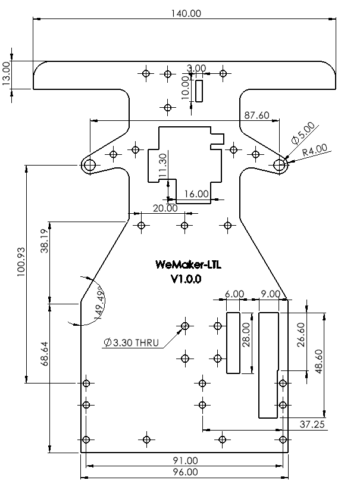
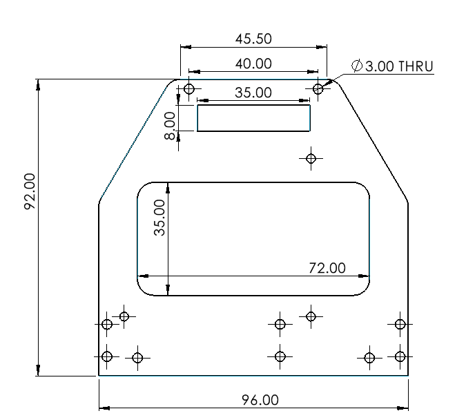
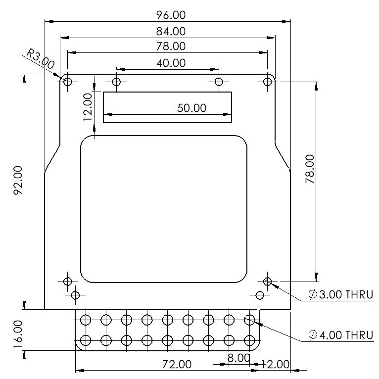

# Part Files

## Chassis (Laser cutting)

您可根據下列 DXF 檔案進行雷射切割，以製作本設計所需的底盤與結構件。

* [Bottom](../hardware/DXF/Plate.DXF)

* [Middle](../hardware/DXF/Plate_2.DXF)

* [Top](../hardware/DXF/Plate_3.DXF)

## Bracket (3D Printing)
透過下列提供的檔案，您可使用光固化 3D 列印方式製作零件，組裝出與本機構相同的結構。

* [Bearing Bracket](../hardware/STL/Bearing%20Holder_1.STL)

* [Bearing Bracket](../hardware/STL/Steering%20Holdor-1-1.STL)

* [Steering Knucle](../hardware/STL/ST%20Knuckle-18.STL)
