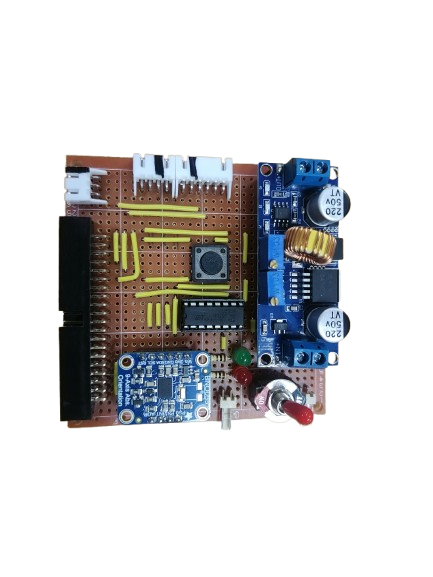
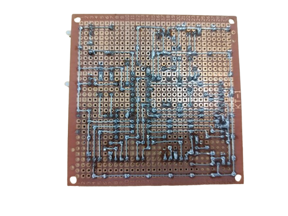

## 
底盤製作與材料選擇
 

- ### 底盤材料選擇
我們的機構底盤採用了 3mm 椴木板搭配雷射切割機製作。椴木板屬於質地細緻、密度較低的闊葉木材料，由多層椴木單板壓合而成，結構穩定且重量輕盈，非常適合使用雷射切割機進行高精度加工，能有效提升底盤的製作效率與精度。
- 優點
    - 質地輕盈易於加工
    - 表面平整適合雷射雕刻精細作業

- ### 轉向機構材料選擇
我們採用光固化技術製作轉向機構。光固化是一種透過特定波長的光（通常為紫外光 UV）觸發光敏樹脂聚合反應，將液態樹脂快速轉化為固體的加工技術，具備高精度與快速成型的優勢，非常適合用於製作細節複雜且結構精細的機械零件。
- 優點
    - 高精度成型可達到 0.05mm 甚至更細的細節，適合製作複雜結構與精密零件
    - 成品表面細緻，後處理相對簡單，適合直接使用
    - 可一體列印成型，減少零件數量與組裝誤差

- ### 電路板
自行購買材料設計焊接而成。

  <table>
    <tr>
      <th style="text-align: center;">電路板上視圖</th>
      <th style="text-align: center;">電路板下視圖</th>
    </tr>
    <tr>
      <td>
        
      </td>
      <td>
        
      </td>
    </tr>
  </table>

