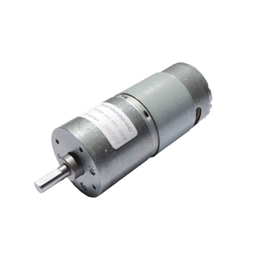
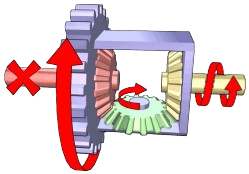

## 
Mobility Design and Steering Mechanism（移動設計與轉向機構）
 

### 前輪伺服馬達

前輪轉向機構使用了MG90S 金屬齒輪伺服馬達作為驅動元件。MG90S 是一款小型高扭力伺服馬達，具備金屬齒輪傳動結構，具有良好的耐用性與抗衝擊能力，特別適合應用於需要穩定轉向的自走車系統。透過 PWM 控制可精準設定角度，搭配阿克曼轉向機構可實現穩定且真實的車輛轉彎行為。

- 優點
  - 扭力充足，最大可達約 1.8 kg·cm（4.8V）
  - 金屬齒輪結構，耐磨損、壽命長，適合承受較大負載
  - 易於安裝到有限空間中
  - 反應靈敏、角度控制精確，適合轉向用途

### 後輪直流馬達

在後輪驅動部分使用一顆620RPM 的直流馬達（DC Motor）作為動力來源。直流馬達具有轉速穩定、控制方式簡單的特性。本系統透過金屬齒輪組將馬達輸出連接至變速器，以調整扭力與轉速的傳遞效率，使車輛具備良好的啟動能力與穩定的行進速度。金屬齒輪具有良好的強度與耐磨性，可提升整體傳動系統的壽命與可靠度。

- 優點
  - 控制簡單，可透過 PWM 輕鬆調整速度
  - 可提供穩定扭力，適合驅動車輪
  - 搭配金屬齒輪與變速機構，提升扭力輸出並延長使用壽命
  - 兼具穩定推進與反應速度

### Ackermann Steering Mechanism (阿克曼轉向機構介紹)

本設計採用了 **阿克曼轉向機構（Ackermann Steering Mechanism）** 作為前輪轉向方案。該機構透過幾何設計，使車輛在轉彎時前輪能指向同一圓心，內外輪轉向角度不同，符合理想轉彎軌跡。這種設計常見於真實汽車中，能有效提升轉彎穩定性與轉向效率。本車輛的阿克曼機構由光固化3D列印製作，搭配伺服馬達驅動，實現準確且穩定的轉向控制。
- 優點
  - 減少輪胎在轉彎時的滑移與磨損
  - 提高轉彎的穩定性與效率
  - 模擬真實車輛的轉向行為，提升真實感與控制精度
  - 可與伺服馬達整合，實現精準轉角控制

阿克曼轉向機構

### 變速機構

我們考慮使用差速器結構作為後輪驅動的變速機構之一。差速器是一種可以同時傳遞動力與允許左右車輪轉速不同的機構，常用於汽車後輪驅動系統中。當車輛直線行駛時，兩側輪子等速旋轉；當轉彎時，內外側輪子轉速不同，差速器內部的行星齒輪則會自動補償兩側轉速差，維持動力平衡並減少輪胎摩擦。

圖 1（左圖）| 展示車輛直行時的差速器狀態，左右輪轉速一致，綠色中間齒輪不轉。

圖 2（右圖）| 展示車輛轉彎時的狀態，一側輪子轉速下降，差速器內部齒輪開始旋轉來補償另一側輪子的加速。

  
  

<b>圖 1（左）：直行狀態  圖 2（右）：轉彎補償</b>

樂高變速器

