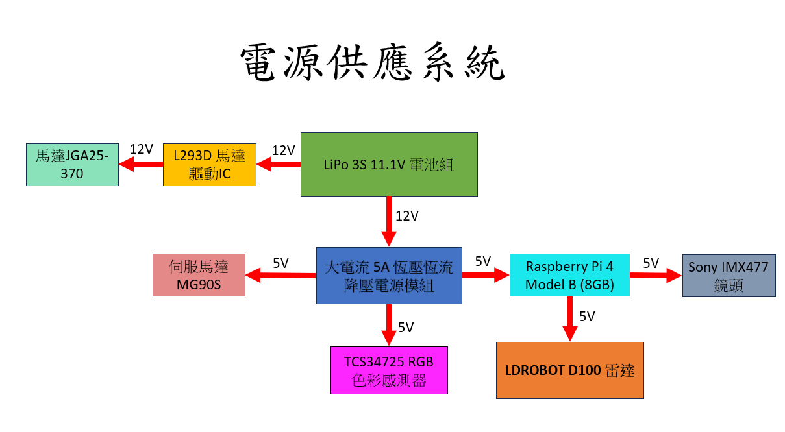

## 
電源系統設計
 
- 電源系統概要圖

    

- 電池

    原先我們採用 18650 鋰電池 作為電源供應，但由於樹莓派運作時需要穩定的 5V 電壓，而單顆 18650 電池的電壓範圍介於 4.2V 至 3.0V，即使透過升壓模組轉換，當電量下降過快時仍容易導致 電壓不穩，進而產生 系統重啟、螢幕閃爍，甚至在寫入過程中造成 SD 卡損壞 等問題。

    為了解決上述問題，我們改採 LiPo 3S 11.1V 鋰聚合物電池 作為主要電源。雖然需要額外配置降壓模組來將電壓轉為穩定的 5V，但相較於單顆 18650 電池，其具有 更高的輸入電壓裕度與更穩定的電流輸出，能有效改善電壓不穩所帶來的風險，並提升系統運行的可靠性與安全性。

  <table>
    <tr>
      <th style="text-align: center;">18650充電電池</th>
      <th style="text-align: center;">LiPo 3S 11.1V 鋰聚合物電池</th>
    </tr>
    <tr>
      <td>
        
      </td>
      <td>
        
      </td>
    </tr>
  </table>

